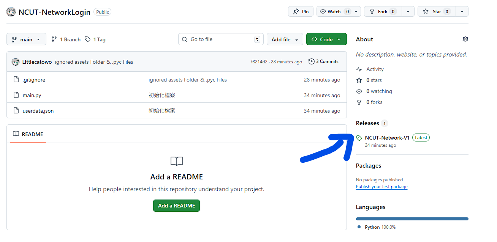
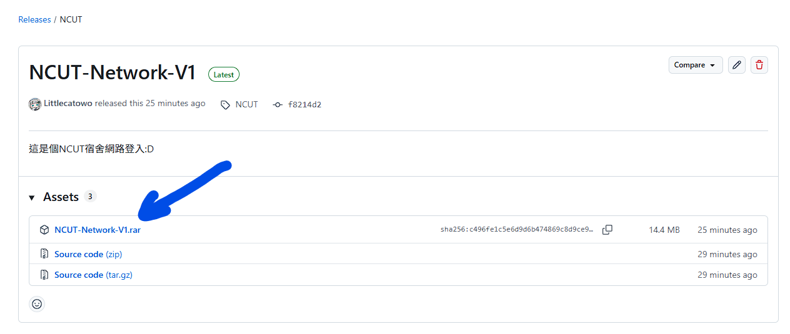
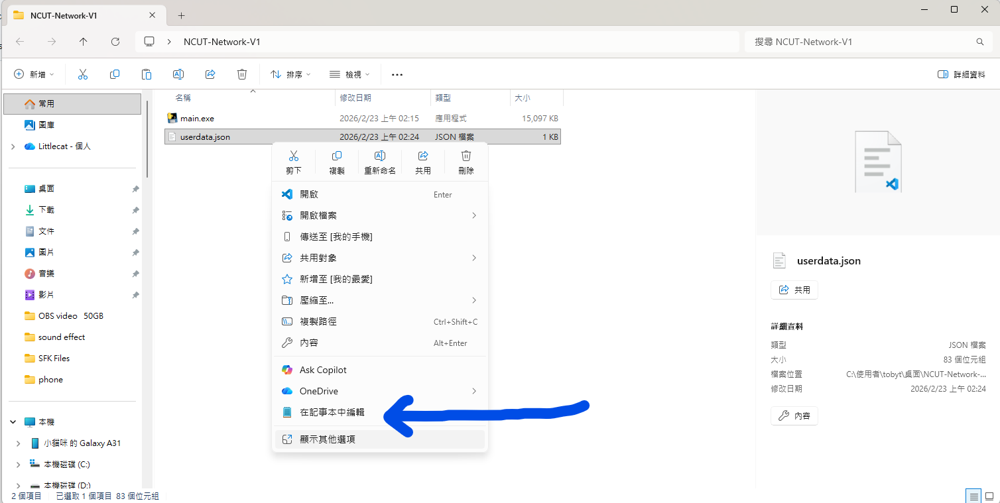
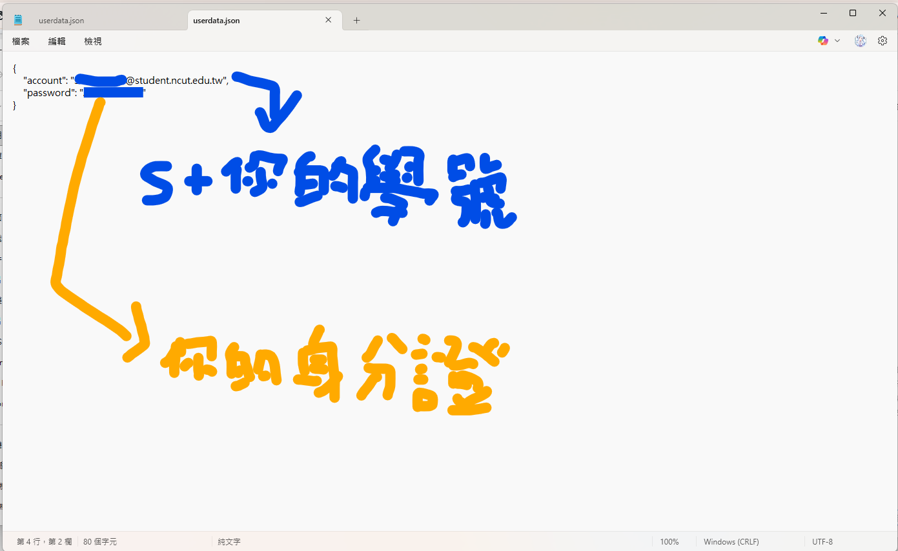

## <div align=center>NCUT Network Auto Login<br>勤益科技大學宿舍 自動登入網路</p></div>

## <div>前置作業
- ### 哩ㄟ主機
>  請確認你的主機有以下任一選擇達成<br>
> 1. 有插上RJ-45網路線
> 2. 或者插無線網卡USB(或者主機板有內建網路晶片)
    >> 連上 TANetRoaming 這個 WIFI<br>

## <div>準備過程
- ### 到 Release 頁面
> 下載最新釋出的 ZIP 檔案，然後解壓縮到你喜歡的地方
</img>
</img>

- ###  userdata.json
> 先用記事本打開 userdata.json，輸入你的帳號跟密碼
```json
{
    "account": "輸入你的帳號", // s你的學號@student.ncut.edu.tw
    "password": "輸入你的密碼" // 密碼預設為 身分證字號 
}
```
</img>
</img>

## <div>打開 main.exe，你的網路就可以持續連線了:D